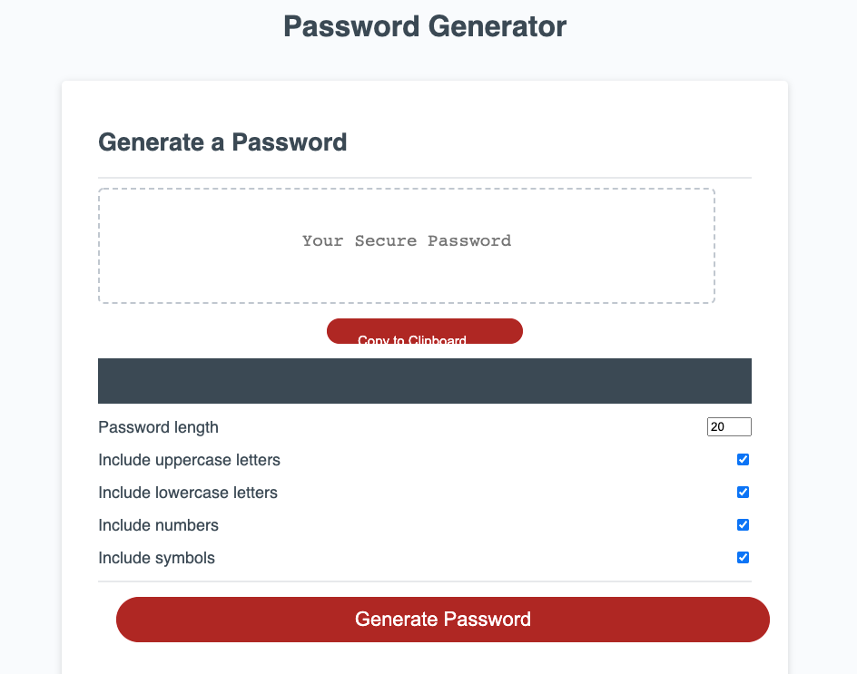

# 03 JavaScript: Password Generator

## Your Task

This week’s homework requires you to modify starter code to create an application that enables employees to generate random passwords based on criteria that they’ve selected. This app will run in the browser and will feature dynamically updated HTML and CSS powered by JavaScript code that you write. It will have a clean and polished, responsive user interface that adapts to multiple screen sizes.

The password can include special characters. If you’re unfamiliar with these, see this [list of password special characters](https://www.owasp.org/index.php/Password_special_characters) from the OWASP Foundation.

## User Story

```
AS AN employee with access to sensitive data
I WANT to randomly generate a password that meets certain criteria
SO THAT I can create a strong password that provides greater security
```

## Acceptance Criteria

```
GIVEN I need a new, secure password
WHEN I click the button to generate a password
THEN I am presented with a series of prompts for password criteria
WHEN prompted for password criteria
THEN I select which criteria to include in the password
WHEN prompted for the length of the password
THEN I choose a length of at least 8 characters and no more than 128 characters
WHEN asked for character types to include in the password
THEN I confirm whether or not to include lowercase, uppercase, numeric, and/or special characters
WHEN I answer each prompt
THEN my input should be validated and at least one character type should be selected
WHEN all prompts are answered
THEN a password is generated that matches the selected criteria
WHEN the password is generated
THEN the password is either displayed in an alert or written to the page
```

## Mock-Up

The following image shows the web application's appearance and functionality:


## Grading Requirements

This homework is graded based on the following criteria: 

### Technical Acceptance Criteria: 40%

* Satisfies all of the preceding acceptance criteria plus the following:

  * The homework should not produce any errors in the console when you inspect it using Chrome DevTools.

### Deployment: 32%

* Application deployed at live URL.

* Application loads with no errors.

* Application GitHub URL submitted.

* GitHub repository that contains application code.

### Application Quality: 15%

* Application user experience is intuitive and easy to navigate.

* Application user interface style is clean and polished.

* Application resembles the mock-up functionality provided in the homework instructions.

### Repository Quality: 13%

* Repository has a unique name.

* Repository follows best practices for file structure and naming conventions.

* Repository follows best practices for class/id naming conventions, indentation, quality comments, etc.

* Repository contains multiple descriptive commit messages.

* Repository contains quality readme file with description, screenshot, and link to deployed application.

## Review

You are required to submit the following for review:

* The URL of the deployed application.

* The URL of the GitHub repository, with a unique name and a readme describing the project.

- - -
© 2021 Trilogy Education Services, LLC, a 2U, Inc. brand. Confidential and Proprietary. All Rights Reserved.


# 03 JavaScript: Password Generator

## Your Task

This week’s homework requires you to modify starter code to create an application that enables employees to generate random passwords based on criteria that they’ve selected. This app will run in the browser and will feature dynamically updated HTML and CSS powered by JavaScript code that you write. It will have a clean and polished, responsive user interface that adapts to multiple screen sizes.

The password can include special characters. If you’re unfamiliar with these, see this [list of password special characters](https://www.owasp.org/index.php/Password_special_characters) from the OWASP Foundation.


# Password Generator - Homework 3, UW Coding Bootcamp

## Description

For the third week of the UW Coding Bootcamp my homework invited me to build a password generator that enables employees to generate random passowrds based on criteria that they've selected. The app I built runs in the browser and features dynamically updated HTML and CSS powered by JavaScript code. It has a clean, polished, and responsive user interface that adapts to multiple screen sizes. It allows the user to select the length and character types of the password they would like to generate and will then allow the user to copy it to the clipboard. 

## Built With

* [GitHub](https://github.com/spencee1315/hw_wk3)
* [Net Comber](https://www.net-comber.com/charset.html)

## Deployed Link

* [See Live Site](https://spencee1315.github.io/hw_wk3/)

## Preview of Working Site



## Code Snippet
This code snippet...........

```javascript 
// Generate password function
function generatePassword(lower, upper, number, symbol, length) {
  // 1. init pw var
  // 2. Filter out unchecked types
  // 3. Loop over length call generator function for each type
  // 4. Add final pw to the pw var and return it

  let generatedPassword = '';

  // need to be able to count number of checked items

  const typesCount = lower + upper + number + symbol;

  console.log('typesCount: ', typesCount);

  const typesArr = [{ lower }, { upper }, { number }, { symbol }].filter
  (
    item => Object.values(item)[0]
  );

  // console.log('typesArr: ', typesArr);

  // pt. 2 
    if(typesCount === 0) {
      return '';
    }

  // pt. 3
    for(let i = 0; i < length; i += typesCount) {
      typesArr.forEach(type => {
        const funcName = Object.keys(type)[0];
        // console.log('funcName: ', funcName);

        generatedPassword += randomFunc[funcName]();
      });
    }

    console.log(generatedPassword.slice(0, length));

    const finalPassword =  generatedPassword.slice(0, length);

    document.getElementById("password").innerHTML = finalPassword;

    return finalPassword;
}

//Generator functions - https://www.net-comber.com/charset.html
function getRandomLower() {
  return String.fromCharCode(Math.floor(Math.random() * 26) + 97);
}

function getRandomUpper() {
  return String.fromCharCode(Math.floor(Math.random() * 26) + 65);
}

function getRandomNumber() {
  return String.fromCharCode(Math.floor(Math.random() * 10) + 48);
}

function getRandomSymbol() {
  const symbols = '!@#$%^&*(){}[]=+_-|?<>/<>,.'
  return symbols[Math.floor(Math.random() * symbols.length)];
}
```

### Authors

* **Elliott Spencer**

### Contact Information

* [Link to Portfolio Site](https://spencee1315.github.io/hw_wk2/)

* [Link to Github](https://github.com/spencee1315)

* [Link to LinkedIn](https://www.linkedin.com/in/elliott-spencer-886a9818/)
